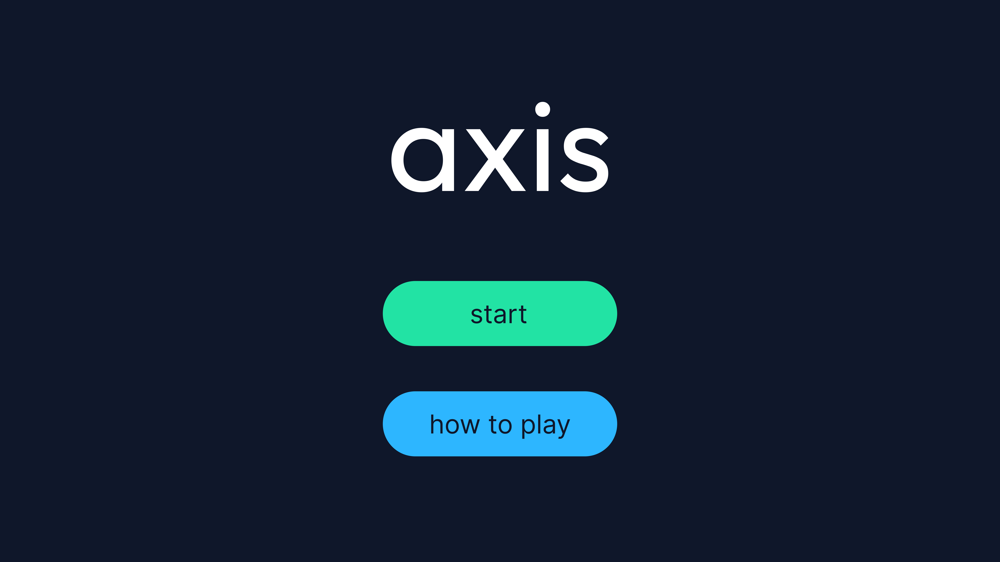
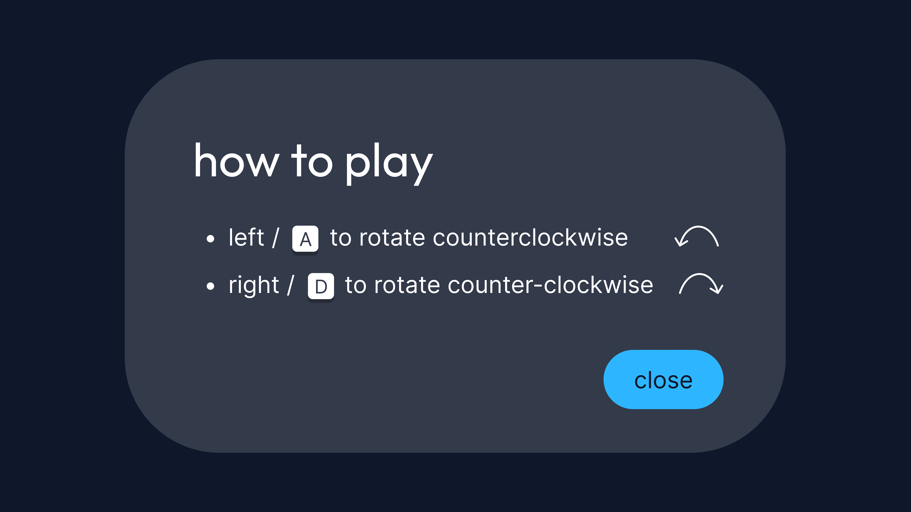

# axis

a minimalist rotation platformer

### overview

axis is a physics-based platformer where the world rotates instead of the player moving traditionally.

### controls
a / left arrow - rotate world counterclockwise
d / right arrow - rotate world clockwise

### preview
##### main menu

##### info panel

##### end screen

#### credits
- fonts: [Outfit](https://fonts.google.com/specimen/Outfit) and [Inter](https://fonts.google.com/specimen/Inter) from google fonts
- assets made in figma

#### status
currently in development
